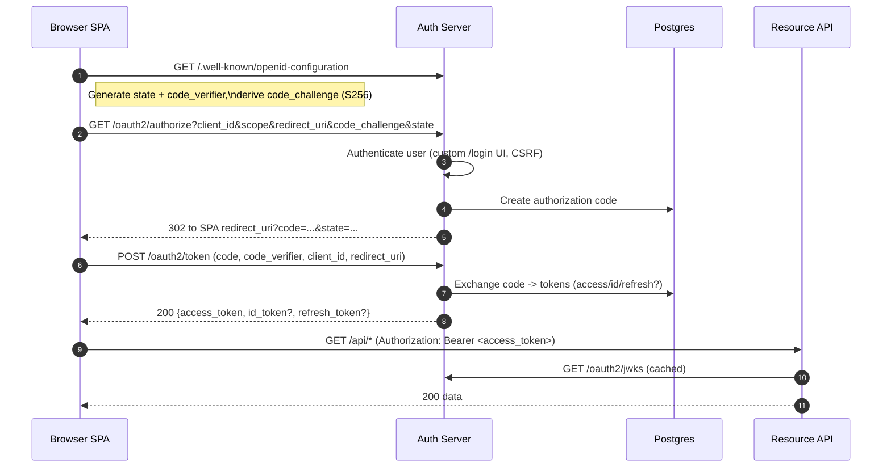
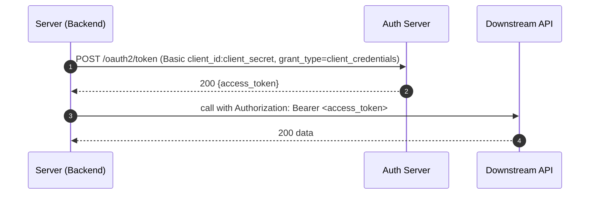

# System Design — Custom OAuth2 / OIDC Authorization Server

A complete system design for your **Custom OAuth2 / OIDC** stack built on **Spring Authorization Server (SAS)** with a custom React login UI, Postgres, Redis, and resource APIs (Go, Java, Node, .NET). This document includes architecture diagrams, data flow, scaling, security, observability, trade-offs, and pros & cons.

> **Example IPs/hosts** used throughout:
>
> - **Auth Server (issuer)**: `http://10.201.240.154:8080`
> - **Client machine / SPA & API**: `http://10.201.240.239`
> - Prefer `http://localhost` for local SPAs to avoid PKCE WebCrypto HTTPS constraints.

---

## 1) Objectives & Constraints

### Objectives
- Standards-compliant OAuth2/OIDC: Auth Code + PKCE, Client Credentials, Refresh Token.
- Multi-app support: SPAs, native apps, server backends.
- Horizontal scalability with minimal shared state.
- Strong issuer consistency across environments.
- Secure key management (JWKS), token validation, and API protection.

### Constraints
- Some teams deploy without HTTPS in dev; SPAs must run on `http://localhost` for PKCE WebCrypto.
- Cross-machine networking (Auth Server and APIs on different hosts/ports) requires CORS and exact redirect URIs.
- Postgres and Redis availability influence login and token issuance SLAs.

---

## 2) High-Level Architecture

```
                         +-----------------------------+
                         |        DNS / CDN / WAF      |
                         +-----------------------------+
                                     |
                               HTTPS (Public)
                                     |
                      +-------------------------------+
                      |   Authorization Server (SAS)  |  <-- Spring Authorization Server
                      |  - /.well-known               |
  Browser SPA  --->   |  - /oauth2/authorize         |
  Native App   --->   |  - /oauth2/token             |
  Server App   --->   |  - /userinfo                 |
                      |  - /connect/register (DCR)   |
                      |  - /connect/logout           |
                      |  - /oauth2/jwks              |
                      +-----------+-------------------+
                                  | (JDBC, Session)
                   +--------------+--------------+
                   |                             |
            +------v------+                +-----v-----+
            |  Postgres   |                |   Redis   |
            | (clients,   |                | (sessions,|
            | tokens,     |                | cache)    |
            | consents)   |                +-----------+
            +-------------+
                                  JWKS (Public Keys)
                         +--------------------------------+
                         |  Resource APIs (Go, Java, ...) |
                         |  - Validate JWT (iss, sig,     |
                         |    exp/nbf, scope, aud)        |
  SPA / Native  -------> |  - CORS for SPA origins        |
                         +--------------------------------+
```

**Key ideas**
- Auth Server is mostly stateless; persistent data in Postgres; session/cache in Redis.
- APIs validate JWTs **locally** using **JWKS** — no per-request call to the Auth Server.
- SPAs are **public clients** (no secret) and use **PKCE**; backends are **confidential clients** (secret kept server-side).

---

## 3) Sequence Diagrams

### 3.1 Authorization Code + PKCE (SPA)



### 3.2 Client Credentials (server-to-server)



---

## 4) Data Model (SAS default tables)

- `oauth2_registered_client` — client metadata: `client_id`, `client_secret` (nullable for public), redirect URIs, grants, scopes, client settings (e.g., `requireProofKey=true`).
- `oauth2_authorization` — authorization code, access/refresh/id token values, metadata, expirations.
- `oauth2_authorization_consent` — consented scopes per client (if you show a consent page).

---

## 5) Deployment Views

### 5.1 Development (single node or docker-compose)
- **Auth Server**: `http://10.201.240.154:8080`
- **SPA**: `http://localhost:5174` (or `http://10.201.240.239:5174`)
- **Go API**: `http://10.201.240.239:8082`
- Issuer configured explicitly as `http://10.201.240.154:8080` to avoid proxy header surprises.

### 5.2 Production (HA)
- **Auth Server**: ≥2 replicas behind a load balancer; enable **Spring Session + Redis** for login sessions.
- **Postgres**: managed service or HA cluster; backups and PITR.
- **Redis**: HA/cluster; TTLs for session and flow state.
- **APIs**: ≥2 replicas; JWT validation cached in memory (JWKS refresh).
- **TLS/Certificates**: HTTPS on public edges; HSTS and modern ciphers.
- **Observability**: central logs, metrics, dashboards, alerts, tracing.

---

## 6) Security Design

- **PKCE mandatory** for public clients (SPAs/native).
- **Client secrets never** in browser bundles (SPAs). Use **Docker secrets** or vault on servers.
- **Issuer constancy**: configure `spring.security.oauth2.authorizationserver.issuer` explicitly to the public URL.
- **JWT validation** at APIs: `iss`, signature (JWKS), `exp/nbf`, (optional) `aud`, and **scopes**.
- **CORS**: allow SPA origins and `Authorization` header; support `OPTIONS` preflight.
- **Token lifetimes**: short-lived access tokens (15–30 min); refresh tokens with rotation.
- **Key rotation**: rotate signing keys periodically; serve old keys until all tokens expire.
- **Rate limiting** and login throttling; CSRF protection on login UI and admin/DCR as needed.

---

## 7) Reliability & Scaling

- **Auth Server** is stateless → horizontal scale linearly. Redis removes sticky session dependency.
- **APIs** validate tokens offline → no runtime dependency on Auth Server (beyond JWKS refresh).
- **DB** and **Redis** are critical paths for issuance/login; ensure redundancy, monitoring, and backups.
- **JWKS caching**: APIs should cache JWKS and refresh out-of-band with backoff.

---

## 8) Observability

- **Logging**: include `client_id`, `sub`, request IDs; avoid logging tokens.
- **Metrics**: login success/failure, token issuance rate, latency, error codes, JWKS refresh success.
- **Tracing**: propagate correlation IDs across SPA → API → downstream.
- **Audit**: client registration changes, failed logins, revocations, admin actions.

---

## 9) Trade-offs, Pros & Cons

### A) Token Type (JWT vs Opaque + Introspection)
**JWT (chosen)**  
- **Pros**: self-contained; high performance; APIs don’t call Auth Server per request; easy horizontal scale.  
- **Cons**: Revocation is eventual (until expiry); careful key rotation; larger tokens in transit.

**Opaque + Introspection**  
- **Pros**: central control; instant revocation; small token size.  
- **Cons**: Runtime dependency on introspection endpoint; may throttle scale; more infra coupling.

### B) SPA Storage (Session storage vs memory vs cookies)
- **Session storage**: survives tab reloads; cleared per-tab scope. *Risk:* XSS can access tokens.  
- **Memory**: safest against persistence theft; but lost on refresh → needs silent renewal.  
- **HttpOnly cookies**: safer from XSS but introduce CSRF and same-site complexity.

### C) Refresh Tokens in SPAs
- **Pros**: Fewer re-logins; long-lived sessions.  
- **Cons**: Larger attack window if token is stolen; require rotation and theft detection.

### D) PKCE in Dev (HTTP vs HTTPS)
- **HTTP + localhost** works; any other host on HTTP breaks WebCrypto (Crypto.subtle).  
- Using **HTTPS locally** removes this constraint but adds setup complexity.

### E) Redis for Sessions
- **Pros**: No sticky sessions; easy HA; faster logins across replicas.  
- **Cons**: Extra infra; operational overhead; needs sizing and eviction policies.

### F) Audience Claim (`aud`)
- **Pros**: API can reject tokens not intended for it; better isolation in multi-API deployments.  
- **Cons**: More configuration; mismatch can cause 401s until aligned.

### G) Consent Screens
- **Pros**: Transparency on scopes; auditability; least privilege.  
- **Cons**: UX friction; more DB writes; often skipped in internal systems.

---

## 10) Common Failure Modes & Mitigations

| Failure | Cause | Mitigation |
|---|---|---|
| **Issuer mismatch** | Apps use a different URL than discovery `issuer` | Configure issuer explicitly and consistently; freeze hostnames in env |
| **CORS blocked** | SPA origin not allowed; `Authorization` header missing | Add SPA origin & headers; allow methods + preflight |
| **“No matching state found”** | Login started outside SPA; storage cleared mid-flow | Initiate from SPA; don’t clear storage; consistent callback origin |
| **Crypto.subtle not available** | Using HTTP on non-localhost | Use `http://localhost` or HTTPS locally; or JS SHA-256 fallback |
| **Stale JWKS** | API didn’t refresh keys after rotation | Short JWKS cache TTL + background refresh; keep old keys served |
| **DB/Redis outage** | Auth issuance relies on them | HA setup + monitoring; circuit breakers; friendly errors |
| **Token theft** | XSS, logs, or misconfig | CSP, no token logs, rotate quickly, minimal scopes, short TTL |

---

## 11) Capacity Planning (Rules of Thumb)

- **Auth Server QPS**: driven by login/refresh rates. Autoscale; pool DB connections.
- **Postgres**: monitor write IOPS (auth churn) and connection limits; use HikariCP.
- **Redis**: size for session count × TTL; set eviction; monitor memory/latency.
- **APIs**: CPU-bound JWT verification; cache JWKS; avoid per-request discovery.

---

## 12) Configuration Snippets (Recap)

**Auth Server (issuer & headers)**
```yaml
server:
  port: 8080
  forward-headers-strategy: none

spring:
  security:
    oauth2:
      authorizationserver:
        issuer: "http://10.201.240.154:8080"
```

**Go API (env)**
```
API_PORT=8082
FRONTEND_ORIGIN=http://localhost:5174
OAUTH_ISSUER=http://10.201.240.154:8080
```

**React SPA (env)**
```
VITE_OIDC_ISSUER=http://10.201.240.154:8080
VITE_OIDC_CLIENT_ID=<spa_client_id>
VITE_REDIRECT_URI=http://localhost:5174/oidc/callback
VITE_API_BASE=http://10.201.240.239:8082/api
```

---

## 13) Roadmap & Extensions

- Device Authorization Grant for TVs/consoles.
- Pushed Authorization Requests (PAR) and JAR.
- Token Exchange for microservices delegation.
- Multi-tenant issuer routing and per-tenant keys (if required).
- Admin UI for client management and audit exports.

---

## 14) Pros & Cons Summary (Quick Reference)

**Pros**
- Standards-based; interoperable with many stacks.
- High performance for APIs via local JWT validation.
- Horizontal scaling with minimal coupling.
- Flexible: SPA/public, backend/confidential, native supported.

**Cons**
- Secret handling and PKCE nuances add setup complexity.
- Issuer/redirect URI exactness is non-negotiable (brittle in dev).
- JWT revocation is eventual; key rotation needs discipline.
- CORS, CSRF, cookies can be tricky across origins.

---

## 15) Checklists

**API Validation**
- [ ] Validate `iss` equals configured issuer  
- [ ] Validate signature via JWKS (cache & refresh)  
- [ ] Validate `exp/nbf` with small clock skew  
- [ ] Validate `aud` (if used)  
- [ ] Enforce scopes (e.g., `api.read`)  
- [ ] Log `client_id`, `sub`, scopes for audit

**SPA Integration**
- [ ] Use PKCE (`code_challenge=S256`)  
- [ ] Initiate login from SPA (state stored)  
- [ ] Exact `redirect_uri` registered  
- [ ] Send `Authorization: Bearer <access_token>` to API  
- [ ] Handle token expiry/refresh; secure storage strategy

**Auth Server Ops**
- [ ] Issuer set explicitly, not inferred from proxy headers  
- [ ] DB migrations applied; backups & PITR  
- [ ] Redis HA for sessions (if used)  
- [ ] JWKS rotation schedule; old keys retained until expiry  
- [ ] Rate limiting on `/login` and `/oauth2/token`  
- [ ] Observability: logs, metrics, alerts

---

*End of document.*
